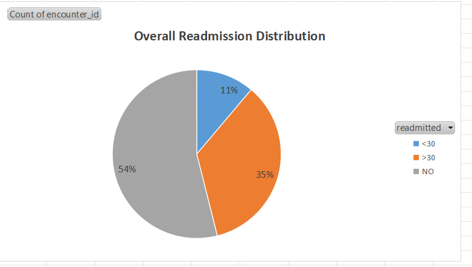
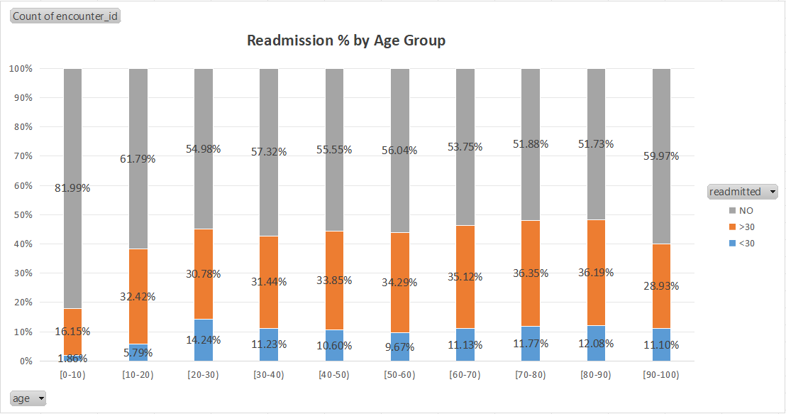
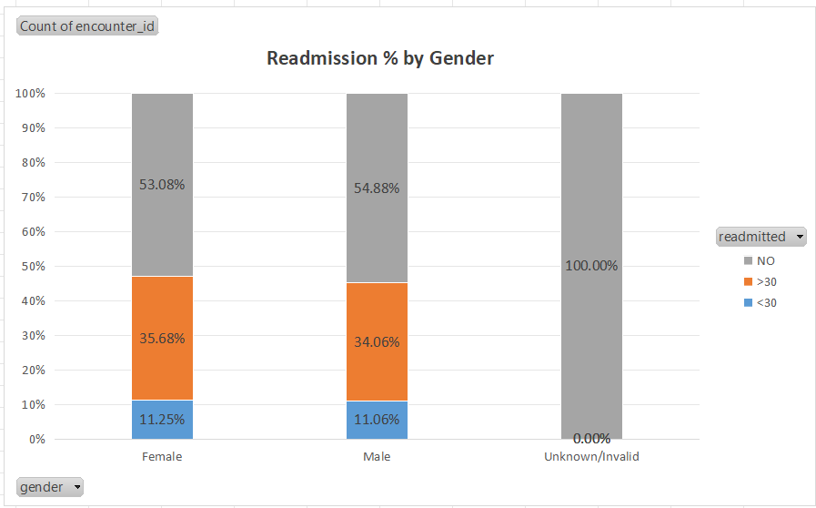
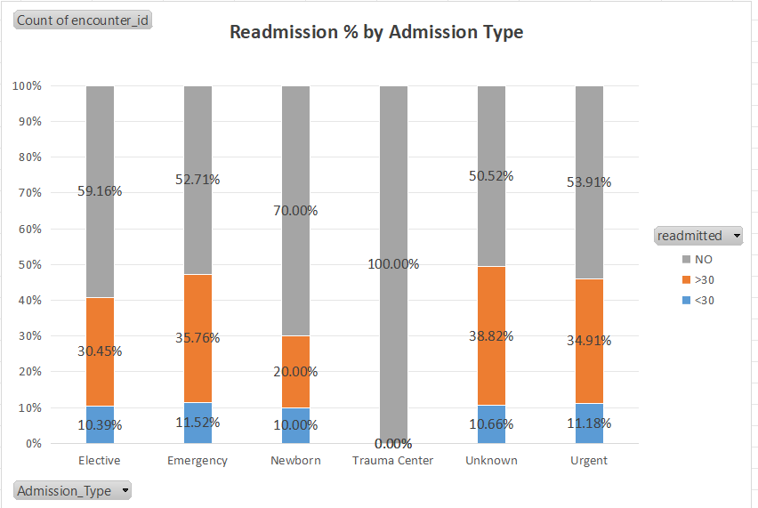
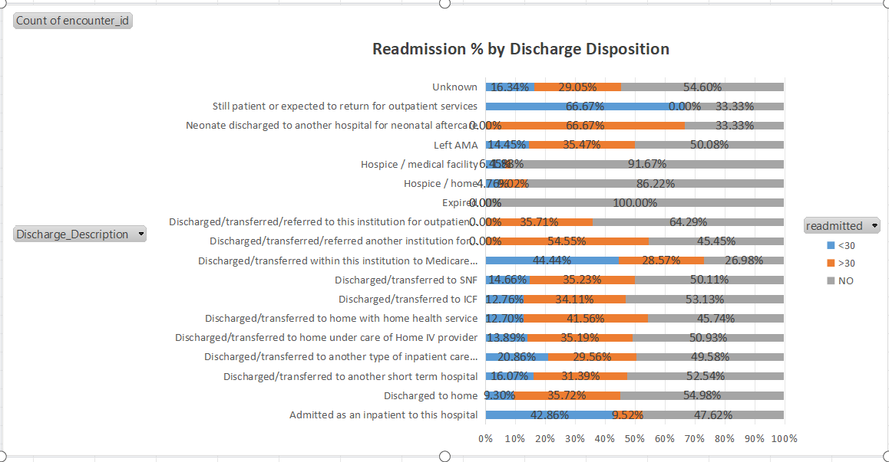
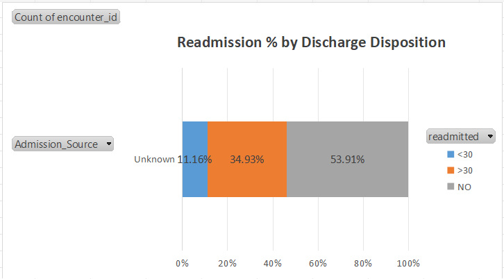

# Hospital Readmission Analysis (Excel Dashboard)

📊 **Objective:**  
Analyze hospital readmission patterns to identify key drivers and provide actionable insights for healthcare providers.

---

## 🔑 Key Highlights
- Conducted **end-to-end analysis of 100K+ patient records**.  
- Cleaned and mapped categorical IDs using **XLOOKUP** and conditional logic.  
- Built **interactive Excel dashboards** with:
  - KPI Cards
  - Pie Charts
  - Stacked Bar Charts
- Evaluated readmissions across **age, gender, admission type, and discharge disposition**.  
- Identified that **11.16% of patients were readmitted within 30 days**, with higher rates in **Emergency admissions** and **SNF discharges**.  

---

## 📂 Repository Contents
- `hospital_dashboard.xlsx` → Excel file with pivot tables & dashboard.  
- Chart Images (for quick preview):
  -   
  -   
  -   
  -   
  -   
  -   

---

## 📈 Dashboard Overview
This project uses **Excel Pivot Tables + Charts** to deliver a simple yet powerful dashboard for healthcare analysis.  

Key visualizations include:  
- **Overall Readmission Distribution**  
- **Readmission % by Age Group**  
- **Readmission % by Gender**  
- **Readmission % by Admission Type**  
- **Readmission % by Discharge Disposition**  

---

## 🚀 Skills Demonstrated
- Data Cleaning & Mapping (XLOOKUP, IFERROR)  
- Pivot Tables & Pivot Charts  
- Dashboard Design in Excel  
- Healthcare Data Analysis  

---

## 📜 License
This project is licensed under the **MIT License**.

